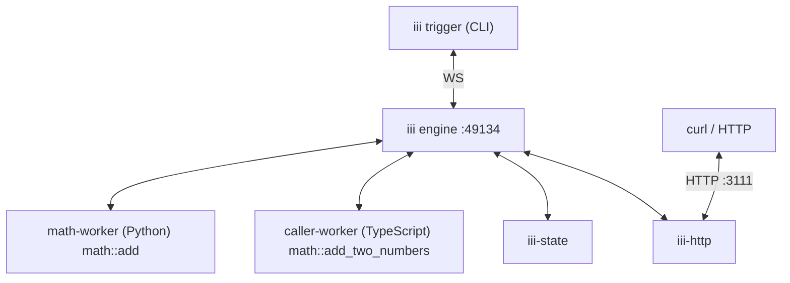

Unix gave processes a single interface. React gave components a single interface. iii gives every
category of software (queues, schedulers, agents, frontends, sandboxes, business logic, etc.) a
single interface: **Workers** host work, **Functions** are the work, **Triggers** are what causes
the work to run, and the **Engine** routes between them. Once you have a mental model for those four
pieces, everything else in iii is a variation on a theme.

<Note>This page uses the [Quickstart tutorial](/quickstart) as an example.</Note>

## The four pieces

This is a brief recap of the four pieces. More details about their actual usage are in
[Using iii / Workers](/using-iii/workers) and the rest of the "Using iii" section.

### Worker

A Worker is anything that connects to the Engine and registers Triggers and Functions with it.
Workers can run anywhere (on a laptop, in a container, in a browser tab, on a microVM) and in any
language as long as they can open a WebSocket to the Engine.

### Trigger

A Trigger is what causes a Function to run. A Trigger has a type (HTTP, cron, queue message, state
change, another Function calling `trigger`), a configuration (which path, which schedule, which
queue), and the function ID it invokes.

### Function

A Function is a named handler inside a Worker. It takes a payload and returns a result. Function
identifiers follow a `service::name` convention so they remain stable across worker restarts and
language boundaries.

### Engine

The Engine is the coordinator. It accepts worker connections, maintains a live registry of available
Functions and Triggers, and routes invocations to whichever Worker currently provides the requested
Function.

## The Quickstart

The Quickstart tutorial produces a running system with two Workers connected to the same Engine:

1. `math-worker` is a Python Worker that registers `math::add`.
1. `caller-worker` is a TypeScript Worker that registers `math::add_two_numbers`, which calls
   `math::add` through the Engine.

By the end of the Quickstart, the system also includes the `iii-state` and `iii-http` Workers, an
HTTP Trigger that exposes `math::add_two_numbers` at `POST /math/add-two-numbers`, and a key-value
scope named `math` holding a `running_total`.

The runtime topology looks like this:

Every arrow is a WebSocket connection between a Worker and the Engine. There is no direct
worker-to-worker traffic. When `caller-worker` invokes `math::add`, the call goes through the
Engine, which looks up the current location of `math::add` in its registry and routes the invocation
to `math-worker`.

## Workers

Both Workers in the Quickstart fulfill the same contract: open a WebSocket connection to the Engine.
Once connected they can register Functions, register Triggers, and `trigger()` other Functions. A
Worker will typically do at least one of these things but ultimately isn't required to do any of
them.

The Python and TypeScript Workers are independent processes in different languages, with different
runtimes, possibly on different machines. Neither one knows the execution context of the other. They
both talk to the Engine, and the Engine handles the rest.

This is what "any language, any runtime" means in practice: the worker contract is small enough to
implement in any language that can use a WebSocket and JSON, and the Engine treats every Worker the
same regardless of how it was built or where it runs.

<Note>
  See [Workers](/understanding-iii/workers) for process isolation, and
  [Creating Workers / Workers](/creating-workers/workers#worker-lifecycle-states) for the connection
  lifecycle.
</Note>

## Triggers

A Trigger has three parts: a type, a configuration, and the function ID it invokes. The Quickstart
tutorial invokes Functions with Triggers in three different ways:

1. The CLI `iii trigger math::add a=2 b=3` is a Trigger fired by the CLI itself. The Engine routes
   the invocation to whatever Worker provides `math::add`.
1. The SDK call `worker.trigger({ function_id: 'math::add', ... })` is another version of the same
   idea: one Function inside one Worker firing a Trigger that invokes another Function, routed
   through the Engine just like the CLI version.

   Both paths work against any registered Function without registering an explicit Trigger; every
   `registerFunction()` inherently gets a Trigger that can be invoked with these two methods.

1. The HTTP Trigger added by the `iii-http` Worker is done through `worker.registerTrigger()` and is
   the common reactive way to implement Triggers.

   In this example `iii-http` owns the HTTP socket; when a request arrives at
   `POST /math/add-two-numbers` the following happens:
   1. `iii-http` looks up the matching Trigger and fires a request targeting the `math::add`
      Function.
   1. The Engine receives the request and routes the invocation to `caller-worker`.
   1. Finally the response flows back the same way. The `math::add` Function never sees an HTTP
      request. It sees a payload, like every other call.

One Function can have many Triggers. The same Function could be invoked by a cron schedule, a queue
message, and a direct CLI call.

<Note>
  See [Triggers](/understanding-iii/triggers) for trigger types, invocation modes, the trigger
  pipeline, the trigger lifecycle, and trigger conditions.
</Note>

## Functions

`math::add` and `math::add_two_numbers` are Functions. Their identifiers follow `service::name`. The
`math` namespace groups related Functions together, and the name identifies the specific handler.
However grouping is arbitrary, and while we recommend using a structured `path::to::functions` there
is no enforcement of them within iii.

Function IDs are stable across worker restarts. When `math-worker` stops and restarts, callers do
not need to know: they keep invoking `math::add`, and the Engine routes the calls to whichever
instance currently provides that Function.

Functions are defined synchronously but can be invoked asynchronously due to the decoupling between
Triggers and Functions.

<Note>
  See [Functions](/understanding-iii/functions) for identifier conventions, direct invocation, and
  multiple Triggers per Function. See
  [Triggers / Invocation modes](/understanding-iii/triggers#invocation-modes) for sync and
  fire-and-forget behavior.
</Note>

## The Engine

The Engine is a single process that holds the registry of every connected Worker and every
registered Function and Trigger. When a Worker connects, the Engine records what Functions it
provides. When a Worker disconnects, the Engine removes its Functions, cancels any in-flight
invocations of those Functions, and notifies the rest of the system that the topology changed.

Routing is independent of language, runtime, and location. The Engine does not need to know where
`math::add` is running in Docker, on a Raspberry Pi, or in a browser tab. It just knows that _some_
Worker provides it. The same tutorial can be redeployed across different runtimes without touching
the function code.

<Note>
  See [Engine](/understanding-iii/engine) for startup flow, config hot-reload, and the live registry
  and discovery surface.
</Note>
